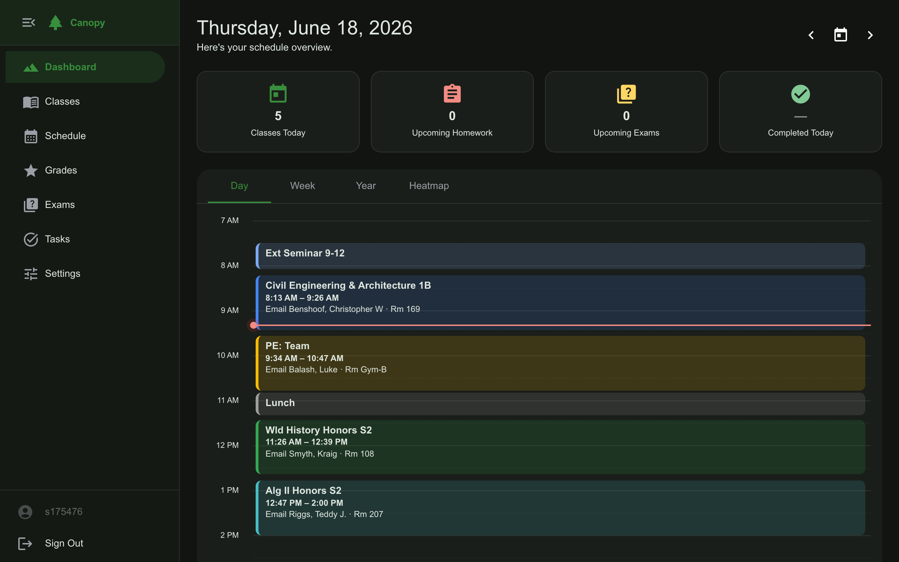
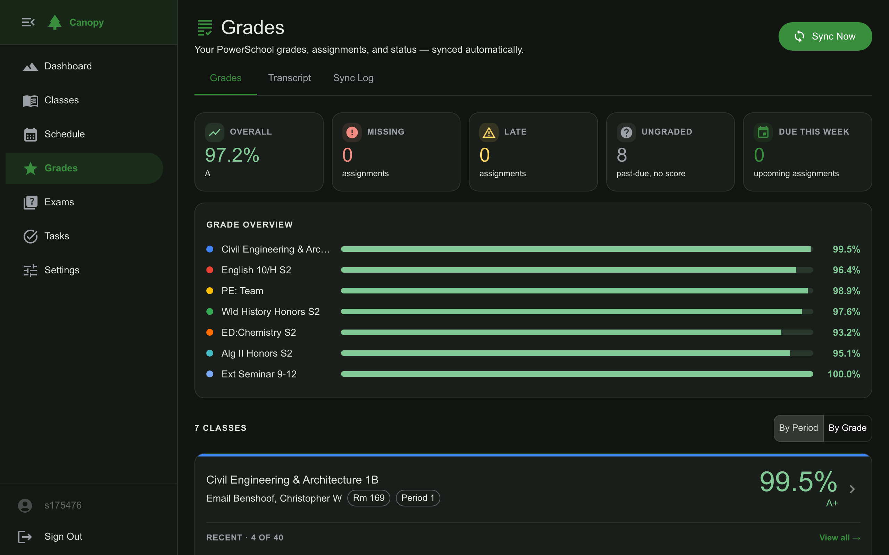
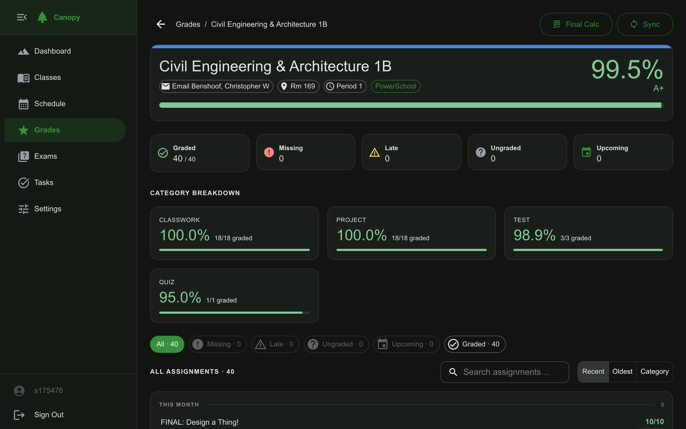
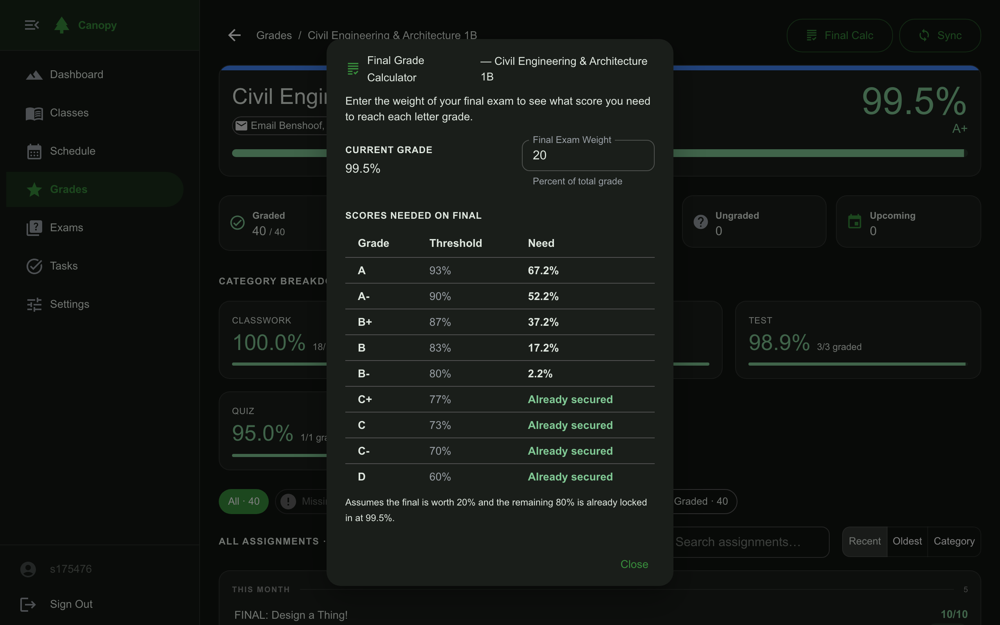
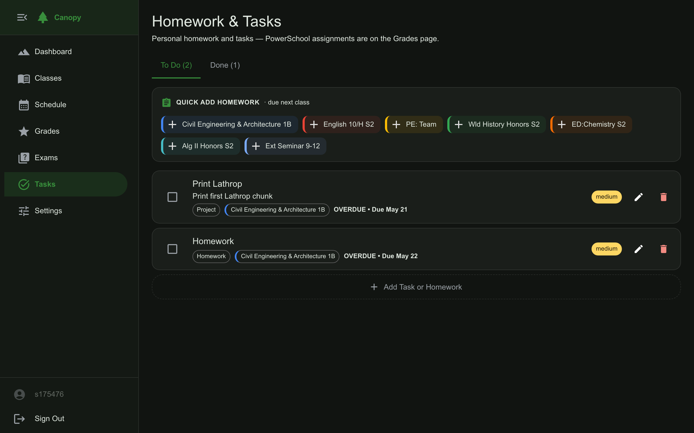
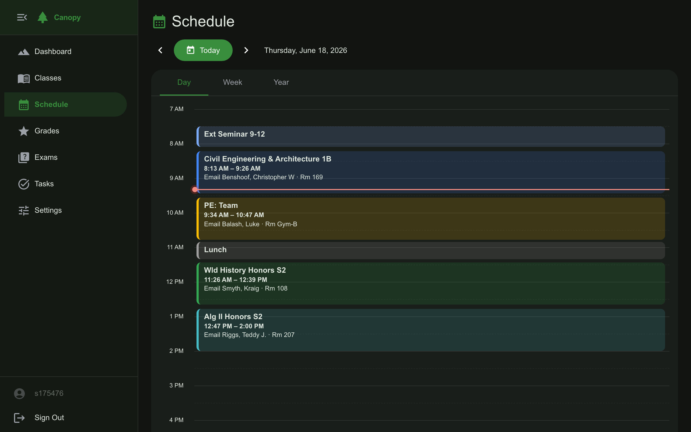
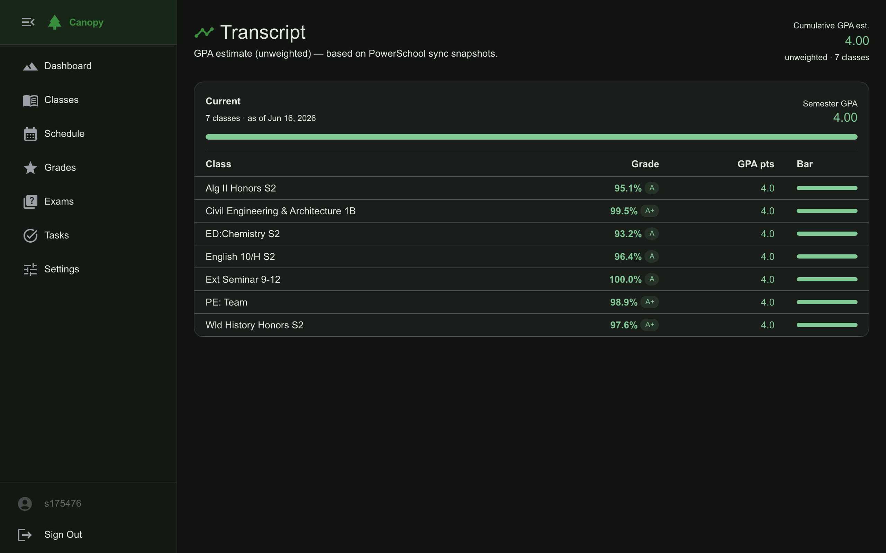
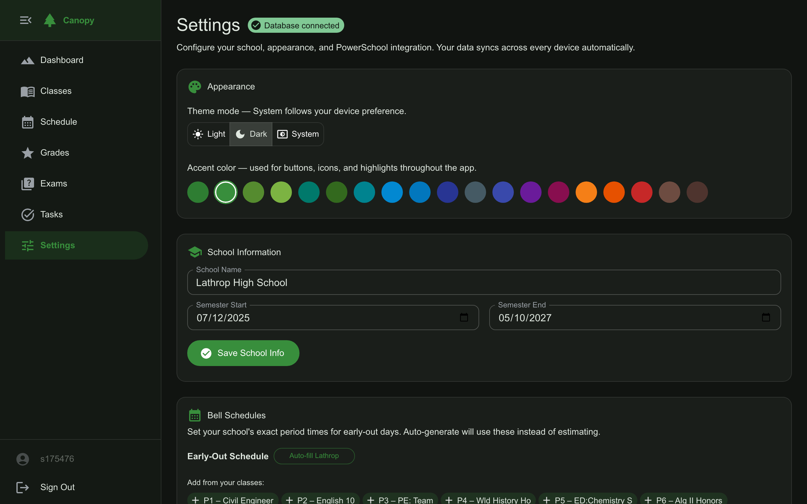

# Canopy — School Planner

> **Built 100% with [Claude Code](https://claude.ai/code)** — every line of code, every feature, every architectural decision.

A personal school planning web app for high school students. Track your classes, schedule, grades, exams, homework, and tasks in one place — with live PowerSchool sync, smart grade analytics, and a workload heatmap.

Live at **[canopy.apexengineeringak.com](https://canopy.apexengineeringak.com)**

---

## Screenshots

### Dashboard
Day, Week, Year, and Heatmap views of your schedule — with at-a-glance stats for today's classes, homework, and exams.



### Grades
Overall GPA, per-class grade bars, category breakdown, missing-work triage, and velocity alerts — all synced live from PowerSchool.



### Grade Detail + Final Exam Calculator
Drill into any class to see every assignment and category breakdown. The **Final Calc** button shows exactly what score you need on the final exam to reach each letter grade.




### Tasks
Unified homework + task list with quick-add, overdue highlighting, and cross-class deadline rebalancing suggestions.



### Schedule
Day / Week / Year calendar with semester bounds, bell schedule support, and early-dismissal overrides.



### Transcript
Cumulative unweighted GPA across all synced semesters with per-class breakdown.



### Settings
Theme, accent color, school info, semester dates, and PowerSchool credentials — everything in one place.



---

## Features

### Core Planner
- **Dashboard** — Day/Week/Year calendar views + Heatmap tab; stat chips for today's classes, homework, and exams
- **Classes** — manage classes with colors, meeting days, period times, and teacher/room info
- **Schedule** — full calendar with semester date cutoff, bell-schedule support, and early-dismissal overrides
- **Exams** — upcoming exam list with countdown and grade-impact preview
- **Tasks** — unified to-do combining PowerSchool homework + custom tasks; filterable, quick-add, bulk clear

### Grade Analytics
- **PowerSchool sync** — headless Chromium scrapes your portal and imports classes, assignments, and grades automatically
- **Category-weight transparency** — shows per-category grade (Tests, Homework, etc.) with most-impactful-assignment callout
- **Grade velocity alerts** — chips on grade cards show week-over-week change (↑2.1% / ↓0.8%)
- **Missing-work triage** — cross-class panel ranked by grade impact ("Lab Report 3 — could cost up to 5.2%")
- **What-if calculator** — pick a category and hypothetical score; see projected grade live
- **Final Exam Calculator** — enter final exam weight; instantly see what score you need for A, A−, B+, …
- **Exam stakes framing** — "Worth 20% — below 75% drops you to a B−" shown on exam cards when weights are set

### Long-term Tracking
- **Workload heatmap** — 14-day forward heatmap colored by due-item density
- **Rebalancing suggestions** — inline captions flag tasks that cluster with other deadlines
- **PowerSchool change log** — reverse-chron feed of every grade change and new assignment detected at sync time
- **Cross-semester GPA** — cumulative unweighted GPA estimate from all synced semesters

### Platform & Auth
- **Multi-user auth** — username/password accounts with server-side sessions
- **Admin dashboard** — aggregate user/content stats with zero private data exposed
- **Dark / light / system theme** — plus 15 accent color choices
- **Vercel + Neon** — zero-ops deployment, scales to zero when idle

---

## Tech Stack

| Layer | Technology |
|---|---|
| Framework | Next.js 16 (App Router) |
| UI | Material UI (MUI) v6 + Emotion |
| Language | TypeScript / React 19 |
| Database | Neon (serverless PostgreSQL) |
| Date handling | dayjs |
| Scraping | Puppeteer Core + @sparticuz/chromium-min |
| Deployment | Vercel |

---

## Getting Started

### 1. Clone and install

```bash
git clone <repo-url>
cd school-planner
npm install
```

### 2. Environment variables

Create `.env.local`:

```env
# Neon PostgreSQL
DATABASE_URL=postgres://...

# Required on Vercel for headless Chromium
CHROMIUM_EXECUTABLE_PATH=/path/to/chromium

# Admin account (change before deploying)
ADMIN_USERNAME=admin
ADMIN_PASSWORD=changeme
```

The database schema is created automatically on first run — no migrations to run manually.

### 3. Run locally

```bash
npm run dev
```

Open [http://localhost:3000](http://localhost:3000). Create an account on first visit; the setup wizard will guide you through school info and PowerSchool credentials.

### 4. Configure your school

In **Settings**:
- Set school name and semester start/end dates (classes outside this range are hidden from the dashboard)
- Enter PowerSchool URL + credentials for sync
- Enable **Lathrop Mode** to auto-apply the Lathrop HS bell schedule after each sync

---

## PowerSchool Sync

The **Sync Now** button (or the one in each class's detail page) launches a headless Chromium session that logs into your PowerSchool portal and imports:

- Class list (name, teacher, room, period)
- All assignments with scores
- Per-category grade breakdowns (when available)

Sync history is recorded in a change log — every score change and new assignment is timestamped and browsable from **Grades → Sync Log**.

On Vercel, this runs as a serverless function with a 60-second timeout and 1 GB memory.

---

## Admin Setup

An admin account is seeded automatically from environment variables on cold start:

```env
ADMIN_USERNAME=admin
ADMIN_PASSWORD=your-secure-password
```

The admin can log in like any user and is redirected to an aggregate dashboard showing total users, active users (7d/30d), content counts, and registrations by month. No usernames, grades, assignments, or any private data are ever shown.

To change the admin password, update the env var in Vercel and redeploy — the hash is updated automatically.

---

## Deployment

1. Create a [Neon](https://neon.tech) project and copy the `DATABASE_URL`
2. Import the repo into [Vercel](https://vercel.com)
3. Add environment variables:
   - `DATABASE_URL`
   - `ADMIN_USERNAME` + `ADMIN_PASSWORD`
   - `CHROMIUM_EXECUTABLE_PATH` (if using Puppeteer on Vercel — see [@sparticuz/chromium](https://github.com/Sparticuz/chromium))
4. Deploy
